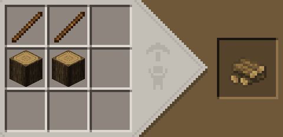
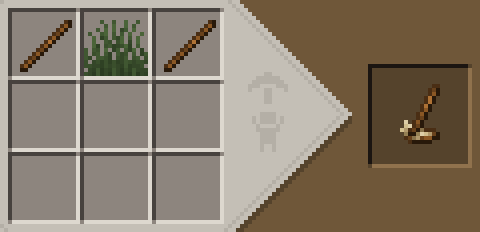
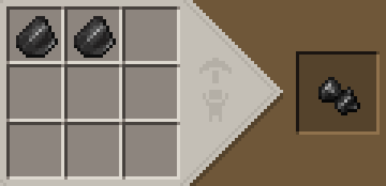
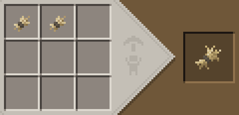
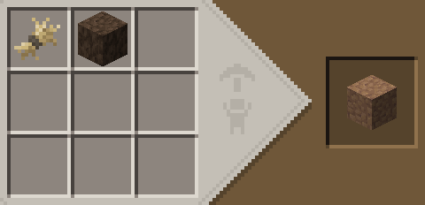
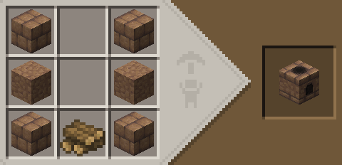
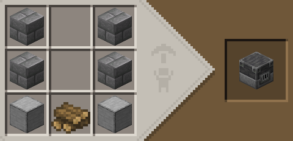

# dthusian's Matcha Flavoured Fork Guide

Since this datapack is a derivative of Klei_Wright's Matcha Flavoured datapack, this documentation applies to both versions. Any changes specific to dthusian's fork will be labelled (dthusian) and changes specific to the official Klei's Matcha Flavoured will be labelled (Klei).

This guide will have spoilers. If you don't like that, you can try using the in-game advancements page, which has a basic progression tree that you can use as a guide.

## General

- (Klei) The day is 3x longer, now 72000 ticks (60 minutes) instead of 24000 (20 minutes).
- (Klei) It is possible to sleep at any time to advance time.
- Hunger has been removed. Sprinting and eating are always possible. Food now restores health instead of hunger.
- Crystal hearts have been added. When consumed, they increase maximum health by 1 heart, up to a maximum of 30 hearts total.
  - (Klei) Crystal hearts are automatically consumed when obtained.
  - (dthusian) Crystal hearts may be consumed by right clicking with them.
- On death, when a player has a crystal heart, their maximum health decreases by 1 heart, down to a minimum of 10 hearts.
  - (dthusian) A crystal heart item is dropped at the location of death. This item is invulnerable and glowing, so it should not be difficult to find.
- Entering water in cold biomes inflicts a freeze-like effect.

## Early-game

Early-game progression has been changed substantially. Here's a brief guide.

- Get wood
- Craft a wooden hoe (vanilla recipe) and break grass with it to collect grass.
- Crafting kindling 
- Either craft tinder, or find gravel and craft a firestarter with flint.  
- Make a campfire by placing kindling and lighting it with tinder or a firestarter.
- Dry short grass using the campfire.
- Craft short dry grass into tall dry grass. 
- Craft tall dry grass into packed mud and mud bricks. 
- Craft a mud kiln. 
- Use your mud kiln to smelt copper ore, or smelt cobblestone into limestone and smooth stone.
- Use smooth stone and stone bricks to craft a blast furnace, which can smelt the remaining metals. 

## Furnaces

The combo of furnace, blast furnace, and smoker have been overhauled in Matcha Flavoured. They have been replaced with:
- the mud kiln, an early-game furnace that can smelt copper and some basic recipes (e.g. smooth stone, glass)
- the blast furnace, a furnace that can smelt all ores and _reverses_ basic recipes (i.e. smooth stone → stone → cobblestone)
- the oven, a furnace that can process all food recipes and basic recipes

Additionally, recipes have been added for the blast furnace:
- Cobblestone → gravel
- Gravel → sand

Recipes have also been added to alloy recycling of tools. Iron, copper, gold, and diamond tools can be smelted into 1 ingot of their corresponding material.

## Mining

- Lapis ore above deepslate has been replaced with quartz ore.
- Redstone ore has been replaced with sulfur ore. Sulfur is equivalent to gunpowder.
  - Above deepslate, it becomes sulfurous quartz ore which drops quartz and maybe sulfur.
- Emerald ore has been replaced with silver ore.
- Blocks of raw ore can be smelted directly. 

## Tools and Enchanting

- Experience points have been removed. Using the anvil is free.
  - There is also no limit on how many times a tool can be repaired.
- Enchanting tables have been removed.
- "Blessings", which are an enchanted book with a set of enchantments, can be crafted. A reference is located below.
- You can make armor out of either tattered leather or sturdy leather. These are considered different materials.
- New alloys have been added. Like netherite, these are applied using the smithing table and an upgrade template.
  - In the material table, composition and applied only apply to alloys.
- Certain materials have "intrinsics" which are basically enchantments or extra effects applied to items crafted out of the material.
- (Klei) Bronze ingots are instead called Hepatizon, and Shakudo tools are instead called Palatinate.

### Alloy Reference

| Material | Applied on | Composition                  |
| -------- | ---------- | ---------------------------- |
| Bronze   | Copper     | 7 copper + 1 silver + 1 gold |
| Shakudo  | Copper     | 7 copper + 3 gold            |
| Electrum | Diamond    | 4 silver + 4 gold            |
| Steel    | Iron       | 1 iron (note 1)              |
| Adamant  | Diamond    | 4 adamant scrap + 4 gold     |

Notes:
1. Steel is made by blasting iron. It takes 160 seconds to perform this recipe, instead of the normal 10 seconds. This is equivalent to the duration of 2 pieces of coal.

### Stats Reference

| Material | Tool Speed      | Tool Durability | Sword Damage | Sword Speed | Axe Damage | Axe Speed |
| -------- | --------------- | --------------- | ------------ | ----------- | ---------- | --------- |
| Wood     | 2 (Pick: 3)     | 200 (Pick: 600) | 4            | 1.6         | 7          | 0.8       |
| Copper   | 6               | 350             | 5            | 1.6         | 9          | 0.8       |
| Iron     | 7 (Shov/hoe: 8) | 500             | 6            | 1.6         | 9          | 0.9       |
| Steel    | 8               | 3000            | 6            | 0.9         | 9          | 0.7       |
| Gold     | 12              | 350             | 4            | 1.6         | 7          | 1         |
| Bronze   | 15              | 1000            | 6            | 1.9         | 9          | 1.1       |
| Shakudo  | 9               | 1000            | 6            | 1.6         | 9          | 1         |
| Diamond  | 9               | 2500            | 7            | 1.6         | 9          | 1         |
| Electrum | 12              | 3000            | 7            | 1.9         | 9          | 1.2       |
| Adamant  | 15              | 5000            | 8            | 1.6         | 10         | 1         |

Armor values are armor/armor toughness/kb resist.
| Material         | Armor Durability | Helmet | Chestplate | Leggings | Boots |
| ---------------- | ---------------- | ------ | ---------- | -------- | ----- |
| Tattered Leather | 200              | 1      | 3          | 2        | 1     |
| Sturdy Leather   | 350              | 2      | 4          | 3        | 2     |
| Chainmail        | 300              | 2      | 6          | 5        | 2     |
| Copper           | 200              | 2      | 4          | 3        | 1     |
| Iron             | 350              | 2      | 4          | 3        | 1     |
| Steel            | 1000             | 2/1/1  | 6/2/2      | 5/1/1    | 2/1/1 |
| Gold             | 200              | 2      | 5          | 3        | 2     |
| Bronze           | 500              | 2      | 6          | 5        | 2     |
| Shakudo          | 500              | 2      | 6          | 5        | 2     |
| Diamond          | 800              | 3/2    | 8/2        | 6/2      | 3/2   |
| Electrum         | 1000             | 3/2    | 8/2        | 6/2      | 3/2   |
| Adamant          | 1500             | 3/3/1  | 8/3/1      | 6/3/1    | 3/3/1 |

### Intrinsics Reference

For armor, if stats differ between different pieces, the stat is listed as helment/chestplate/leggings/boots.

| Material         | Armor Intrinsic    | Tool Intrinsic             | Axe Intrinsic     | Sword Intrinsic          |
|------------------|--------------------|----------------------------|-------------------|--------------------------|
| Tattered Leather | +1 Blocks Safe Fall | -                         | -                 | -                        |
| Sturdy Leather   | +1 Blocks Safe Fall, Proj Prot 2/4/3/2, FFall 3, Traversal 1 | - | - | -                       |
| Wood             | -                  | None                       | None              | None                     |
| Chainmail        | Thorns 3           | -                          | -                 | -                        |
| Copper           | None               | None                       | None              | None                     |
| Iron             | None               | None                       | None              | None                     |
| Steel            | Blast Prot 2/4/3/2 | None                       | Knockback 2       | Knockback 1, Blocking (note 1) |
| Gold             | Fire Prot 2/3/2/2  | Fortune 1                  | Fortune 1, Looting 1 | Looting 1             |
| Bronze           | +0.008 speed       | +0.005 speed               | +0.005 speed      | +0.01 speed, Riposte 1   |
| Shakudo          | Cleansing          | Silk Touch                 | Silk Touch        | Sweep 1, Sanguine        |
| Diamond          | None               | None                       | None              | None                     |
| Electrum         | Apotropiac         | Fortune 3, Lesser Warding  | Smite 2, Fortune 2, Looting 2, Warding | Smite 2, Looting 2, Warding |
| Adamant (note 2) | Prot 1, Unbr 2, +2 Hearts | Unbr 2, +2 Hearts   | Unbr 2, +2 Hearts | Unbr 2, +2 Hearts        |

Notes:
1. You can block without a shield like in pre-1.9 vanilla.
2. Adamant max hp works like this:
  - Your total level of divinity (called internally) is determined by how many adamant pieces of armor you are wearing and whether or not you are holding a piece of divine armor
  - For each level of divinity, you obtain 2 bonus hearts.
  - Bonus hearts behave like hearts from absorption and cannot be restored with food or effects. Instead, they are automatically restored on a global 30s timer, or 15s if you have level 5 (full adamant armor and holding an adamant tool). 

### Blessings Reference

- All recipes require a hell-bound book.

| Name                   | Recipe                                                                | Enchantments                                             |
| ---------------------- | --------------------------------------------------------------------- | -------------------------------------------------------- |
| Elegy of Arachnae      | 4 spider eye                                                          | Bane of Arthropods 5                                     |
| Prayer of The God-King | 3 silver + 4 estus ash + iron ingot                                   | Channeling, Smite 3                                      |
| Prayer of Talos        | 7 block of iron + steel                                               | Density 2, Knockback 2, Punch 2                          |
| Prayer of Yamn         | 4 nautilus shell                                                      | Riptide 1, Respiration 2, Aqua Affinity, Depth Strider 2 |
| Prayer of Daedalus     | diamond pickaxe + diamond axe + diamond + 4 estus ash + divine favour | Efficiency 3, Unbreaking 3                               |
| Elegy of Icarus        | 4 wind charge + wax + 3 feather                                       | Feather falling 2                                        |
| Prayer of Yama         | 4 gold ingot + 4 fire charge                                          | Fire Aspect 1, Flame, Fire Protection 3                  |
| Prayer of Demeter      | 4 golden apple + golden hoe + 3 blue ice                              | Frost Walker 2, Frost Protection 2                       |
| Prayer of Paris        | 7 spectral arrow + stable void                                        | Infinity                                                 |
| Prayer of Ares         | iron sword or spear + red dye + shield + iron helmet                  | Lunge 2, Breach 2                                        |
| Prayer of Glaucus      | azure bluet + 3 nautilus shell                                        | Luck of the Sea 3, Lure 3, Loyalty 1                     |
| Prayer of Lu Ban       | 6 diamond + diamond block + divine favour                             | Mending                                                  |
| Prayer of Apollo       | disc fragment + 4 spectral arrow + 3 gold ingot                       | Impaling 3, Piercing 2                                   |
| Prayer of Artemis      | silver + 4 spectral arrow + 3 porkchop                                | Power 2, Multishot                                       |
| Prayer of Will         | 4 ender pearl                                                         | Reach 1                                                  |
| Prayer of Eros         | 4 shakudo + 4 estus ash                                               | Silk Touch                                               |
| Prayer of Cronus       | 3 echo shard + 4 sculk + iron hoe                                     | Soul Speed 2, Swift Sneak 2                              |
| Prayer of St. Clement  | 2 (Klei) obol (dthusian) gold coin + 2 wool + leather boots           | Traversal 3                                              |
| Prayer of Prometheus   | 4 estus ash + divine fragment + 3 diamond                             | Unbreaking 2                                             |
| Prayer of Man          | 4 nazar + silver + 3 lapis lazuli                                     | Smite 2, Warding                                         |
| Prayer of Aeolus       | 7 wind charge + electrum                                              | Wind Burst 3, Anemos                                     |
| Elegy of Hyacinthus    | 1 hyacinth + 4 wind charge + 3 feather                                | Zephyr                                                   |

## Divine Fragments

Divine fragments are valuable items used in many end-game recipes in this mod.
Here's a list of all sources of divine fragments:
- Breaking down a divine favour (9)
- Breaking a spawner (1)
- Killing Piglin Brutes (1)
- Killing Evokers (1)
- Killing Elder Guardians (1-3)
- Ancient City chests (1-3)
- Stronghold corridor chests (1)

Divine fragments can be used to craft:
- Crystal heart
- Some blessings
- Bedrock buster
- Adamant ingots
- Eye of ender

## Food and Cooking

The brewing system has been removed since it isn't currently possible to change brewing recipes with datapacks. Instead, potion effects can be obtained from the cooking system.
- Most raw food does not restore health when eaten. They can be charred in a mud kiln if you lack other cooking options.
- Food can be cooked normally on a campfire or oven.

Notation: Lists duration of each base effect. + indicates an additional level.

| Food             | Base Effects             | Raw       | Cooked    | Preserved              |            | Prepared Dish         |        | Prepared Dish 2    |             |
| ---------------- | ------------------------ | --------- | --------- | ---------------------- | ---------- | --------------------- | ------ | ------------------ | ----------- |
| Apple            | Regen                    | -         | 0:10      | Canned Apples          | 1:00       | Apple Empanada        | 3:00   |                    |             |
| Golden Apple     | Absorption, Regen        | 2:00/0:30 | 2:00/1:00 | Canned Golden Apples   | 2:00+/0:20 | Golden Pie            | note 1 | Gilded Empanada    | 4:00+/0:45+ |
| Pumpkin          | Resistance               | -         | 0:10      | Pumpkin Jam            | 3:00       | Pumpkin Empanada      | 8:00   |                    |             |
| Crimson Mushroom | Weakness                 | -         | 0:30      | Pickled Crimson Fungus | 1:00+      | Crimson Stroganoff    | 5:00   |                    |             |
| Toadstool        | Poison                   | -         | 0:30      | Pickled Toadstools     | 1:00+      | Toadstool Stroganoff  | 5:00   |                    |             |
| Warped Fungus    | Invisibility             | -         | 0:30      | Pickled Warped Fungus  | 5:00       | Warped Stroganoff     | 10:00  |                    |             |
| Cocoa Beans      | Haste                    | -         | 0:30      |                        |            | Chocolate Chip Cookie | 5:00   | Brownie            | 2:30+       |
| Pufferfish       | Conduit Power            | -         | 0:30      |                        |            | Bokguk                | 8:00   |                    |             |
| Kelp             | Gills                    | -         | 0:10      |                        |            | Gimmari               | 8:00   |                    |             |
| Glow Berry       | Aura                     | -         | 0:03      | Glow Berry Jam         | 0:30       | Glow Berry Crumble    | 1:00   |                    |             |
| Carrot           | Night Vision             | -         | 0:10      | Pickled Carrots        | 5:00       | Carrot Cupcake        | 10:00  |                    |             |
| Golden Carrot    | Night Vision             | 0:30      | 1:00      | Golden Pickled Carrots | 10:00      | Gold Carrot Cupcake   | 20:00  |                    |             |
| Melon            | Fire Resistance          | -         | 0:10      | Rind Jam               | 5:00       | Melon Sorbet          | 10:00  |                    |             |
| Tomato           | Strength                 | -         | 0:10      | Sundried Tomatoes      | 5:00       | Brushcetta            | 2:30+  |                    |             |
| Honey            | Speed, Cleanse Maleffect | -         | 0:30      | Mead                   | 5:00       | Honied French Toast   | 3:00+  |                    |             |
| Chorus Fruit     | Levitation III           | -         | 0:03      |                        | -          | Chorus Mochi          | note 2 |                    |             |
| Sweet Berry      | Health Boost             | -         | 0:10      | Sweet Berry Jam        | 3:00       | Sweet Berry Toast     | 8:00   | Sweet Berry Danish | 8:00        |

Notes:
1. Provides Absorption II for 2:00 and Comfort II for 0:10. 
2. Provides Levitation 30 for 0:01

TODO: document recipes for these

Ingredients:
- Cheese
- Dough
- Flour

Misc dishes:
- Cake
- French Toast
- Gnocchi
- Latke
- Rabbit stew
- Puerquito (Regen 0:30)
- Pupusa
- Ramen
- Squid ink pasta
- Stroganoff
- Stuffed mushrooms

Top-tier dishes:
- Tonkotsu ramen
- Green curry
- Paneer makhani
- Japanese curry

## Building

- Copper can be weathered by crafting it with a water bottle.
- Slabs can be converted back into their original blocks via crafting.
- Most building-material-items (e.g. prismarine shard, mud brick) have been made unobtainable in favour of making the derivative blocks craftable from the basic block.
- Prismarine has been renamed to malachite.

## Villagers

- All villages now spawn as abandoned villages with no villagers present.
  - (Klei) Villages play creepy sounds wnen the player is inside of them.
- Villagers have had their trades completely overhauled.
- Emeralds have been replaced with (Klei) obols (dthusian) gold coins.
- (dthusian) Silver coins and copper coins also exist, at a conversion ratio of 24:1.
- Obols can be obtained by:
  - Selling fish to the fisherman
  - Selling gemstones to the smith
  - Killing pillagers
  - Structure chests
  - Fishing up treasure

TODO: tables documenting villager trades

## Passive Mobs

- Turtles now drop turtle shells instead of turtle scutes.

## Hostile Mobs

- (Klei) Zombies now move faster.
- (dthusian) Zombies have some knockback resistance and have a higher chance of spawning reinforcements. 
- Skeletons now have 10 health (5 hearts)
- Creepers now have 16 health (8 hearts)
- Cave spiders now have 4 health (2 hearts)
- Cave spiders have increased movement speed
- Husks have attack damage increased to 7 (3.5 hearts) and slightly increased speed.
- Withers now drop divine favours instead of nether stars. They can still be used for beacons,
  but can also be broken up into 9 divine fragments.

## Redstone

Redstone has been replaced with electric wire, craftable with 2 copper ingots.

Additionally, several items have been renamed. This is purely a rename and does not affect their function or recipe.
- Redstone block → Electric block
- Redstone comparators → Electric comparators
- Redstone repeater → Electric repeater
- Redstone torch → Electric inverter
- Target block → Copper eye
- Redstone lamp → Electric lamp